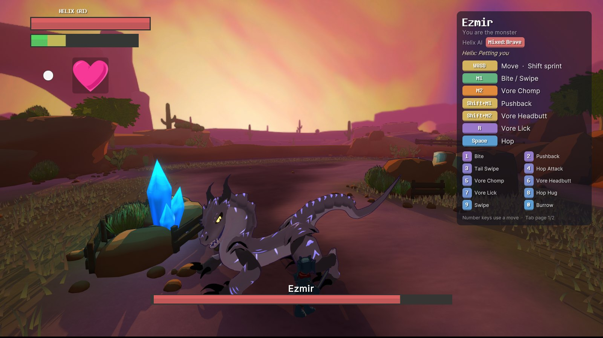

# Helix Monster Play

A mod for **Helix: Feed The World** where you play the monster, very much a work in progress.

**See the full intro with screenshots: https://mewsername.github.io/HelixMonsterPlay/**

- **Solo:** you control the monster against an AI Helix that circles, dodges, learns your attacks, and gets scared or friendly depending on how you treat it.
- **Online:** one of you plays Helix, the other the monster, each on your own PC. Lobby, chat, Steam invites or a short join code.

## Install

1. [Download the mod](https://github.com/Mewsername/HelixMonsterPlay/releases/latest/download/HelixMonsterPlay.zip) (or pick a version under [Releases](https://github.com/Mewsername/HelixMonsterPlay/releases)).
2. Run the game once (it already comes with BepInEx).
3. Unzip into your game folder, the one with `HelixFTW.exe`.
4. Start the game. The main menu has new **Mode** and **Play online** buttons.

Expect bugs, especially online. If something breaks, open an issue and attach `BepInEx\LogOutput.log`.

Helix: Feed The World is made by Serkular, Alsnapz and Crebalt. This repository contains no game files.
